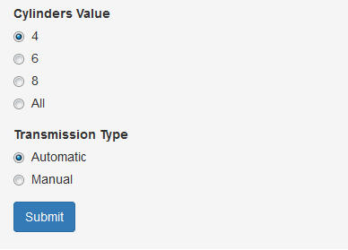
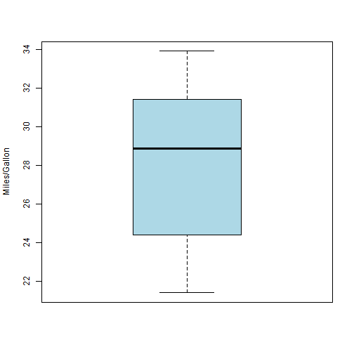
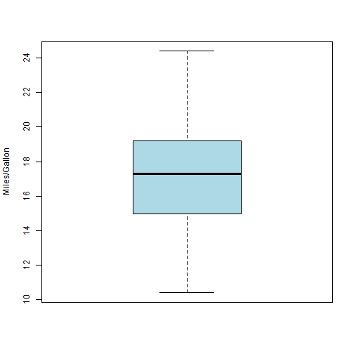

--- 
title       : mtcars Plotting Application
subtitle    : 
author      : Ahmed Elwardany
job         : 
framework   : io2012        # {io2012, html5slides, shower, dzslides, ...}
highlighter : highlight     # {highlight.js, prettify, highlight}
hitheme     : tomorrow      # 
widgets     : [bootstrap]   # {mathjax, quiz, bootstrap}
mode        : standalone    # {standalone, draft}
knit        : slidify::knit2slides
--- .class #id & bg:lightgrey

## mtcars Dataset

- (mtcars) dataset was extracted from the 1974 Motor Trend US magazine, and comprises fuel consumption and 10 aspects of automobile design and performance for 32 automobiles (1973-74 models.

- A data frame with 32 observations on 11 variables.

        mpg     Miles/(US) gallon
        cyl     Number of cylinders
        disp    Displacement (cu.in.)
        hp      Gross horsepower
        drat    Rear axle ratio
        wt      Weight (lb/1000)
        qsec    1/4 mile time
        vs      V/S
        am      Transmission (0 = automatic, 1 = manual)
        gear    Number of forward gears
        carb    Number of carburetors

--- .class #id & bg:lightgrey

## How It Works ?

- This App will simply plot the miles/gallon (mpg) distribution based on your selected cylinders value and type of Transmission in addition to printing out the mean value calculated.

- Just click on your desired cylinder value and type of transmission and then press submit as shown in the below figure.  
  
   

    

--- .class #id & bg:lightgrey

## Example (1)

- Output for cylinders value = 4 and transmission type = Manual
- **Mean Value (mpg)**
[1] 28.07

-
 

--- .class #id & bg:lightgrey

## Example (2)

- Output for cylinders value = All and transmission type = Automatic
- **Mean Value (mpg)**
[1] 17.15

-
 
